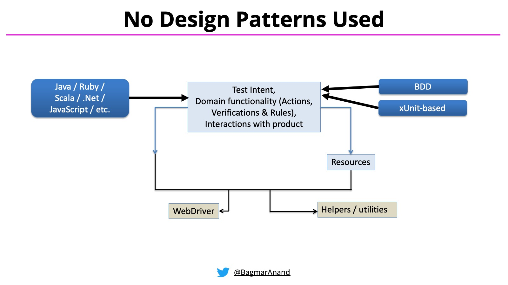

# UI Automation

## Test Architecture and Test Automation

The test architect role has gained importance because of automation. Automation is the key area in modern testing. The
test architecture of automation depends on the framework type you choose.

Examples:


Evaluate the requirements against the automation tools, and choose the best tool for the project.
Create the automation framework based on the industry standard principles and practices.
The framework can be keyword-driven, page object model, hybrid, modular framework, or codeless automation framework

Document the checklist and standards that are necessary to maintain while writing the codes.
Define the automation execution strategy.

## Automation Strategy

- Browser types and browser versions
- Platform or operating system and its version
- Frequency of Sanity, Smoke, and regression tests
- Suite level execution
- Executing different types of tests such as Integration, API, and End to end tests
- Integration with DevOps such as Continuous Integration(CI)/Continuous Delivery (CD) pipelines
- Test reporting and analysis

## Folder Structure

The “flat layout” refers to organising a project’s files in a folder or repository, such that the various configuration
files and import packages are all in the top-level directory

<pre>
├── README.md
├── noxfile.py
├── pyproject.toml
├── setup.py
├── awesome_package/
│   ├── __init__.py
│   └── module.py
└── tools/
    ├── generate_awesomeness.py
    └── decrease_world_suck.py
</pre>
The “src layout” deviates from the flat layout by moving the code that is intended to be importable (i.e. import
awesome_package, also known as import packages) into a subdirectory. This subdirectory is typically named src/, hence
“src layout”.

<pre>
├── README.md
├── noxfile.py
├── pyproject.toml
├── setup.py
├── src/
│    └── awesome_package/
│       ├── __init__.py
│       └── module.py
└── tools/
    ├── generate_awesomeness.py
    └── decrease_world_suck.py
</pre>

## Testing Frameworks

### PyTest

PyTest is a popular testing framework for Python. Learn how to structure and run tests with PyTest.

### Behave

Behavior-driven development (or BDD) is an agile software development technique that encourages collaboration between
developers, QA and non-technical or business participants in a software project. We have a page further describing this
philosophy.

behave uses tests written in a natural language style, backed up by Python code.

## Setup Environment

> create venv

```shell
python3.11 -m venv venv
```

> activate venv

```shell
venv/bin/activate.fish
```

## What is Selenium?

> Install selenium for python

```shell
pip install selenium
```

## Why Selenium with Python?

## Setting Up Selenium with Python

Python is a popular and versatile programming language. Combining Selenium with Python allows for efficient and readable
test scripts, making
it a preferred choice for UI test automation.

### Installing Selenium

> Use pip to install the Selenium package:

```shell
pip install selenium
```

> Example:

```python 
from selenium import webdriver

driver = webdriver.Chrome()

driver.get("http://demoqa.com/")

print(driver.title)

driver.close()
```

### WebDriver

Selenium requires a WebDriver to communicate with the browser. Common choices include ChromeDriver, GeckoDriver (for
Firefox), and others.

> Install driver manager

```shell
pip install webdriver-manager
```

> Architecture of Selenium WebDriver (Selenium 3)


> Architecture of Selenium WebDriver (Selenium 4)


- **Selenium Client library:** Selenium provides support to multiple libraries such as Ruby, Python, Java, etc as
  language bindings
- **JSON wire protocol over HTTP:** JSON is an acronym for JavaScript Object Notation. It is an open standard that
  provides a transport mechanism for transferring data between client and server on the web.
- **Browser Drivers:** Selenium browser drivers are native to each browser, interacting with the browser by establishing
  a secure connection. Selenium supports different browser drivers such as ChromeDriver, GeckoDriver, Microsoft Edge
  WebDriver, SafariDriver, and InternetExplorerDriver.
- **Browsers:** Selenium provides support for multiple browsers like Chrome, Firefox, Safari, Internet Explorer etc.
- **W3C Protocol**. Use standards and specifications that promote compatibility across web technologies

## Basic Selenium Concepts

### Locators

Locators help identify web elements on a page. Common locators include:

| Locators             | Description                                                                                |
|:---------------------|--------------------------------------------------------------------------------------------|
| By.ID                | The first element with the id attribute value matching the location will be returned.      |
| By.NAME              | The first element with the name attribute value matching the location will be returned.    |
| By.XPATH             | The first element with the xpath syntax matching the location will be returned.            |
| By.LINK_TEXT         | The first element with the link text value matching the location will be returned.         |
| By.PARTIAL_LINK_TEXT | The first element with the partial link text value matching the location will be returned. |
| By.TAG_NAME          | The first element with the given tag name will be returned.                                |	
| By.CLASS_NAME        | the first element with the matching class attribute name will be returned.                 |	
| By.CSS_SELECTOR      | The first element with the matching CSS selector will be returned.                         |		

## By.ID

With this strategy, the first element with the id attribute value matching the location will be returned. If no element
has a matching id attribute, a NoSuchElementException will be raised.

> Syntax:

```python
driver.find_element(By.ID, "id_of_element")
```

Example: For instance, consider this page source:

```html
<input autocomplete="off" placeholder="Full Name" type="text"
       id="userName" class=" mr-sm-2 form-control">
```

then the code in python:

```python
user_name = driver.find_element(By.ID, 'userName')
```

## By.XPATH

```
XPath = //tagname[@Attribute=’Value’]
```

- **//:** denotes the current node
- **tagname:** denotes the tag name of the current node
- **@:** denotes the Select attribute
- **Attribute:** denotes the attribute of the node
- **Value:** denotes the value of the chosen attribute

## Types of XPATH

1. Absolute XPath

> /html//div/div/div/div/div/div/div/img

2. Relative XPath

> //img[@alt='JalaImg']

XPath using preceding

> //tagname[@attribute=’value’]//preceding::tagname

Example:
> //input[@type='submit']//preceding::select[@id='input-floating-newsletter-country']

```html
<h1 id="label">This is the text</h1>
```

```python
// h1[ @ id = 'label' and contains(text(), 'text')]
```

## By.PARTIAL_LINK_TEXT

## By.TAG_NAME

## By.CLASS_NAME

## By.CSS_SELECTOR

### Interacting with Elements

Use Selenium to interact with web elements: - Clicking buttons - Filling forms - Navigating between pages

## Click

## SendKeys

## Clear

## Advanced Selenium Techniques

### Waits

Waits help handle synchronization issues. Types of waits include:

- Implicit Wait
- Explicit Wait
- Fluent Wait

## Handling Alerts and Pop-ups

Learn how to handle JavaScript alerts, confirmation dialogs, and pop-ups.

## Organizing Tests

### Page Object Model (POM)

Implement POM for better test structure and maintenance.

## Continuous Integration (CI)

### Integrating Selenium Tests with CI

Integrate Selenium tests into CI/CD pipelines for automated testing.

## Best Practices and Tips

### Maintainability

Follow best practices for writing maintainable and scalable UI tests.
Selenium Best Practice

## References

> Driver Manager: https://pypi.org/project/webdriver-manager/

> ChromeDriver: https://googlechromelabs.github.io/chrome-for-testing/

> Selenium Testing: https://www.browserstack.com/selenium

> Install Firefox https://www.omgubuntu.co.uk/2022/04/how-to-install-firefox-deb-apt-ubuntu-22-04

> CCS Selector https://saucelabs.com/resources/blog/selenium-tips-css-selectors

> Recommendations: https://www.selenium.dev/documentation/test_practices/encouraged/

> Layouts: https://packaging.python.org/en/latest/discussions/src-layout-vs-flat-layout/

> Behave: https://behave.readthedocs.io/en/stable/index.html