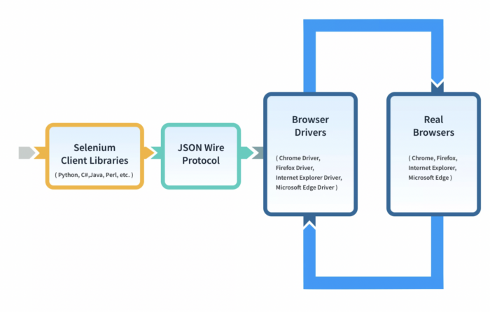
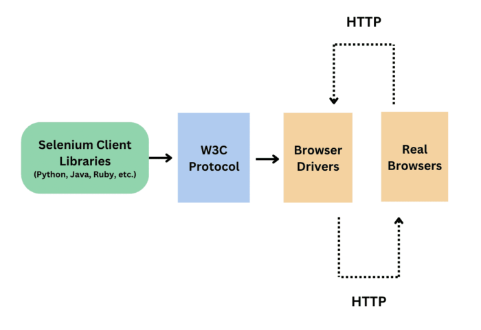

# UI Automation 

## Introduction

## Setup Environment 

> create venv

```shell
python3.11 -m venv venv
```
> activate venv
```shell
venv/bin/activate.fish
```


## What is Selenium?
> Install selenium for python

```shell
pip install selenium
```

## Why Selenium with Python?

## Setting Up Selenium with Python

Python is a popular and versatile programming language. Combining Selenium with Python allows for efficient and readable test scripts, making
it a preferred choice for UI test automation. 

### Installing Selenium 

> Use pip to install the Selenium package: 

```shell
pip install selenium
```

> Example:
```python 
from selenium import webdriver
from selenium.webdriver.chrome.service import Service as ChromeService
from webdriver_manager.chrome import ChromeDriverManager

driver = webdriver.Chrome(service=ChromeService(ChromeDriverManager().install()))

driver.get("http://demoqa.com/")

print(driver.title)

driver.close()
```
### WebDriver

Selenium requires a WebDriver to communicate with the browser. Common choices include ChromeDriver, GeckoDriver (for Firefox), and others.

> Install driver manager
```shell
pip install webdriver-manager
```

> Architecture of Selenium WebDriver (Selenium 3)



>Architecture of Selenium WebDriver (Selenium 4)




- **Selenium Client library:** Selenium provides support to multiple libraries such as Ruby, Python, Java, etc as language bindings
- **JSON wire protocol over HTTP:** JSON is an acronym for JavaScript Object Notation. It is an open standard that provides a transport mechanism for transferring data between client and server on the web.
- **Browser Drivers:** Selenium browser drivers are native to each browser, interacting with the browser by establishing a secure connection. Selenium supports different browser drivers such as ChromeDriver, GeckoDriver, Microsoft Edge WebDriver, SafariDriver, and InternetExplorerDriver.
- **Browsers:** Selenium provides support for multiple browsers like Chrome, Firefox, Safari, Internet Explorer etc.
- **W3C Protocol**. Use standards and specifications that promote compatibility across web technologies

## Basic Selenium Concepts

### Locators

Locators help identify web elements on a page. Common locators include: 

- ID 
- Class Name 
- Xpath 
- CSS Selectors

| Locators             | Description                                                                                |
|:---------------------|--------------------------------------------------------------------------------------------|
| By.ID                | The first element with the id attribute value matching the location will be returned.      |
| By.NAME              | The first element with the name attribute value matching the location will be returned.    |
| By.XPATH             | The first element with the xpath syntax matching the location will be returned.            |
| By.LINK_TEXT         | The first element with the link text value matching the location will be returned.         |
| By.PARTIAL_LINK_TEXT | The first element with the partial link text value matching the location will be returned. |
| By.TAG_NAME          | The first element with the given tag name will be returned.                                |	
| By.CLASS_NAME        | the first element with the matching class attribute name will be returned.                 |	
| By.CSS_SELECTOR      | The first element with the matching CSS selector will be returned.                         |		

## By.ID
With this strategy, the first element with the id attribute value matching the location will be returned. If no element has a matching id attribute, a NoSuchElementException will be raised. 

> Syntax: 

```python
driver.find_element(By.ID, "id_of_element")
```

Example: For instance, consider this page source: 
```html
<input autocomplete="off" placeholder="Full Name" type="text" 
       id="userName" class=" mr-sm-2 form-control">
```
then the code in python:
```python
user_name = driver.find_element(By.ID, 'userName')
```


### Interacting with Elements 

Use Selenium to interact with web elements: - Clicking buttons - Filling forms - Navigating between pages


## Advanced Selenium Techniques 
### Waits 
Waits help handle synchronization issues. Types of waits include: 
- Implicit Wait 
- Explicit Wait 
- Fluent Wait

## Handling Alerts and Pop-ups 
Learn how to handle JavaScript alerts, confirmation dialogs, and pop-ups. 

## Organizing Tests 

### Page Object Model (POM) 
Implement POM for better test structure and maintenance. 

## Testing Frameworks
### PyTest 
PyTest is a popular testing framework for Python. Learn how to structure and run tests with PyTest. 

## Continuous Integration (CI) 

### Integrating Selenium Tests with CI 
Integrate Selenium tests into CI/CD pipelines for automated testing. 

## Best Practices and Tips 

### Maintainability 
Follow best practices for writing maintainable and scalable UI tests. 
Selenium Best Practice

## References

> Driver Manager: https://pypi.org/project/webdriver-manager/

> ChromeDriver: https://googlechromelabs.github.io/chrome-for-testing/

> Selenium Testing: https://www.browserstack.com/selenium

> Install Firefox https://www.omgubuntu.co.uk/2022/04/how-to-install-firefox-deb-apt-ubuntu-22-04